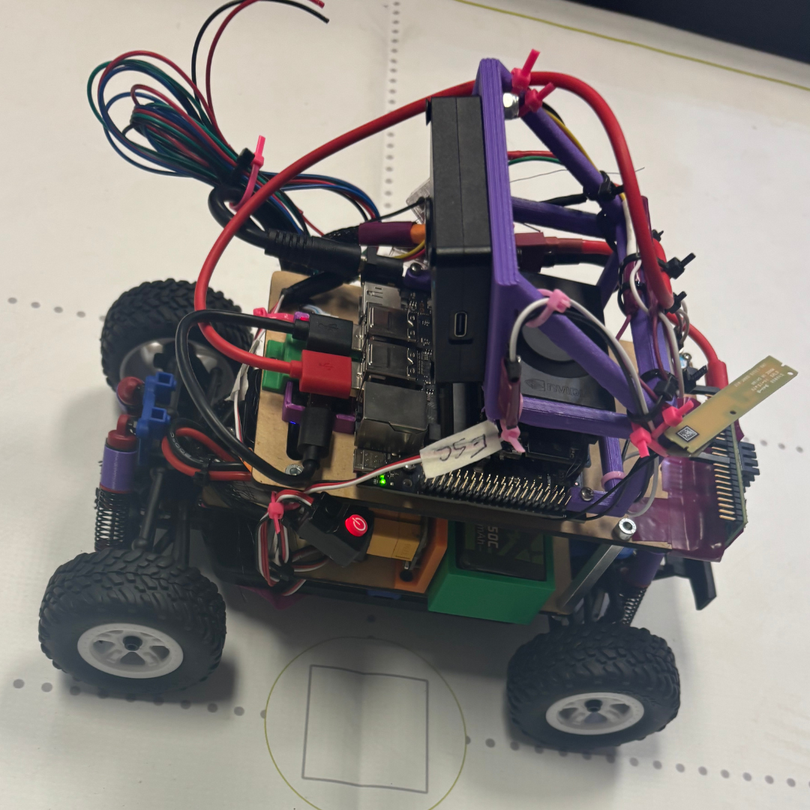
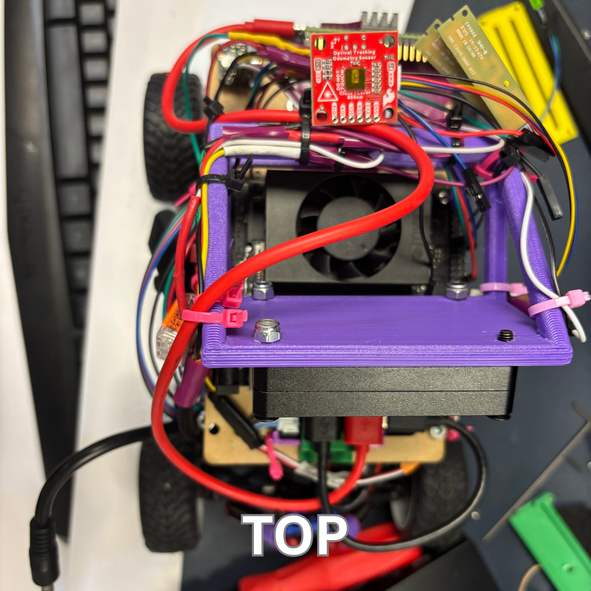
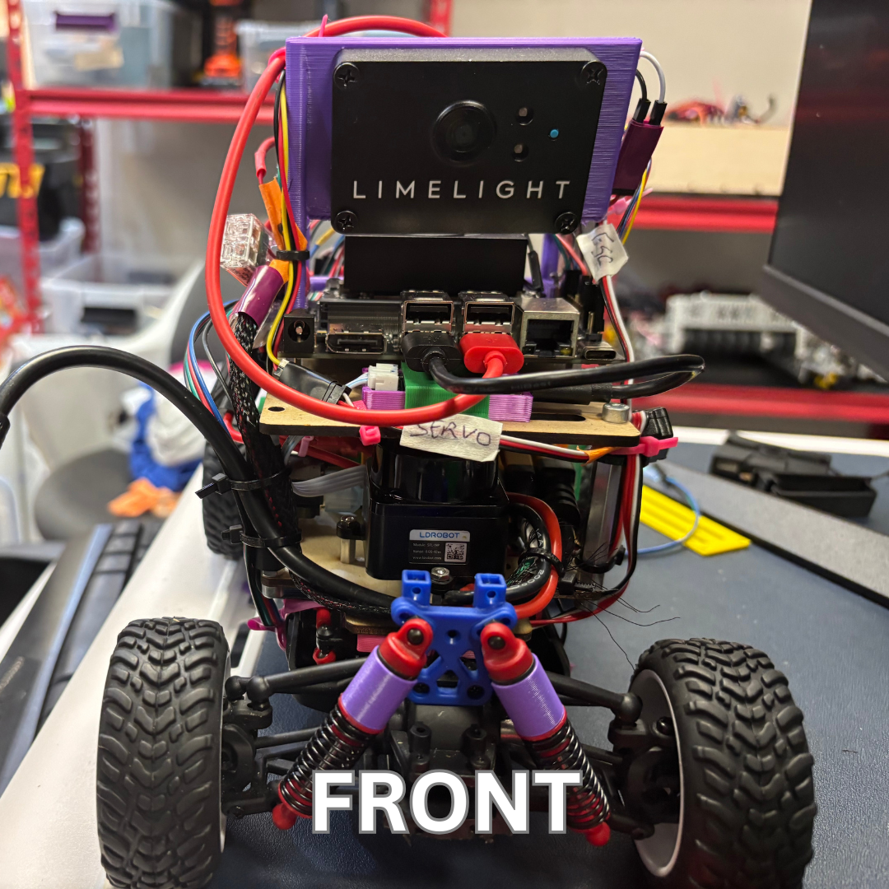
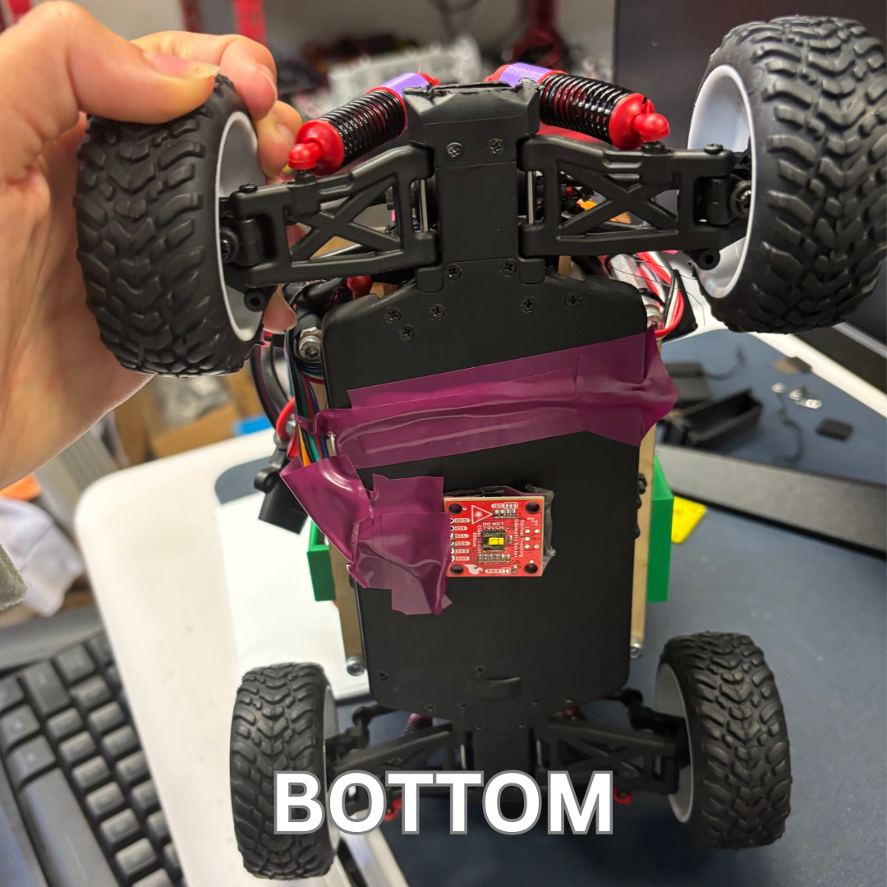

# Team Pictures:
TODO we need to take them today

# Robot Pictures:

  
  
  
  
  
  
  

# Mechanical Parts:

Drive Base: Modified LaTrax Dessert Prerunner base

Drive Motor: ARRMA MEGA 380 BRUSHED MOTOR

Drive Servo: Traxxas Metal Gear 2265

Odometry: SparkFun Optical Tracking Odometry Sensor - PAA5160E1 (Qwiic)

Lidar: LDRobot LD19 Lidar

Battery: Ovonic air lipo 3s 3000 mAh 11.1v

Camera: Limelight 3A

Main Computer: Jetson Orion Nano 

Addtional Computer: Tieensy 4.1

ESC: HOBBYWING QUICRUN WP 1080 G2 Brushed 2-3s ESC 

# Assembly and Manufacturing:

## Base

The first layer of this autonomous vehicle is fabricated out of a modified LaTrax Desert Prerunner base. We chose this specific base because of its durability and the fact that it has a pre-built drivetrain, which makes it easier and quicker to fix issues and find specific parts needed to construct the autonomous vehicle. The bottom plate is made out of durable plastic material, making it stronger than a three-dimensional print, and since it comes out of a stock version of the LaTrax Desert Prerunner, it is easy to replace. The suspension on the front and rear axles is also stock, and the connection between the base and suspension is modular, making it easy to fix issues that require disassembly of the bottom plate. In the middle of the vehicle also runs a solid, metal axle, thus further reinforcing it.

To modify the drivetrain we relpaced three major components:
 1.  For attaching a stronger motor to the base, we removed the top gearbox housing and 3d printed a new one to fit the new, more powerful motor.
 2.  For replacing the servo we simply got one with the same dimensions and replaced it with no need for any new mounts
 3.  To be able to mount new compontents we replaced the blue plate with a new wooden laser cut mount

We also conected the OTOS sensor to the bottom of the car for odometry readings. 

  
  

This was our second version of our base in the begining we attemped to use 3D printing to modle it ourselfs learn more here: [Past Hardware](https://github.com/flutewizard100/WRO26TeamUpForStem/blob/main/Documentation/pastHardware.md)

## First Layer

This layer consists of a laser-cut, wooden base plate that holds mounts for electronic components. Mounts for the battery, the on/off switch,and the Power Distribution Board are 3D printed using PLA and screwed into the base plate. The Lidar is simply mounted by srewing it in directly to the wooden plate. It also supports four metal GoBilda axles that connect the top plate. We choose wood for the material because it is easy and fast to laser cut, and it is less expensive so we have lots of spare material in case the top and middle plates break.

  
  

## Second Layer

The top plate is much like the middle plate; except for the shape and the electronics it holds. It is also made of wood and is laser-cut and attaches 3 diffrent components:
-   The Jetson Nano is directy screwed into the board suported by standoffs.
-   And we connected the teensy perpendicular to the wooden plate.
-   And the 3D printed camera mount is screwed into other holes on the Nano board.
 

  
  
 

# Wiring Diagram:

# Control Structure:

The software we mainly used to connect our hardware components is ros2. We mainly used ros2 because it is a library of software that can be used in robot applications to build or simplify robot application. The way it works is each hardware component is represented by a node which has publishers and subscribers for topics. Topics in ros2 are data streams that allow data to be sent or receive from multiple hardware components or nodes. In order to send data to a topic, you must have a publisher which can only be defined by the node. This is the same for subscribers which receive data from a topic. Subscribers are also defined by the node. An example of this being applied is the Teensy 4.1 node subscribing to the topics motor_speed and servo_angle with the Motor node publishing to the topic motor_speed in order to send the speed the motor should be moving at. The speed, in this example, is sent to the Teensy node because the teensy controls the Motor signals. In the next pages, we will describe in more details the structure of each hardware component in ros2. 

# Low Level Controls (Servo & Motor): 

The Teensy 4.1 node is what we use as the node to control the Motor and Servo. The Teensy 4.1 subscribes to the 2 topics motor_speed and servo_angle to get the speed and angle needed to control the Motor and Servo. This node is mainly used as a low-level controller and has no calculations in order to control the Motor and Servo. The node simply sends the instructions it gets directly to the signals of the Motor and Servo. However, since the Teensy 4.1 is a micro controller. We use a specialized version of ros that is still compatiable with ros2 called micro-ros. Micro-ros is designed for micro controllers which typically has limited memory and processing resources unlike a computer that can handle ros2. The way we apply Micro-Ros is we use it as an extension of the ros2 system, but it is still a separate version which is why you have to run an additional component called the Micro-Ros Agent. So to recap before we go further, we have 2 components that extend ros2: the Micro-Ros which to clarify we will call it Micro-Ros Cilent which is stored in the Micro controller and provides API that can be used to connect to the ros2 system. Then we have the Micro-Ros Agent which bridges Micro-Ros Cilent to Ros2 so it can communicate. TODO (Sagnik) explain Micro-Ros Agent more in context. 

# High Level Controls (Sensors):

TODO Sagnik add explanation of high level nodes and topics and how it works

# Simulation 

One of the ways we helped to speed up the programming process was by working on the obstacle and open-loop navigation code using simulations. For our simulation, we used RViz and Nav2 to help build the scans even without the robot and test our code even if the robot wasn't fully ready. Doing this let us work on the logic and practice using the sensors. Simulation allowed us to see the sensor outputs and use them in our calculations and see what happens in the robot outputs, recreating the nodes so that we can run the exact same file and, in a perfect world, it performs the exact same. However, some sensor outputs are inaccurate, so to account for this, we implemented an EKF to have more accurate readings by combining multiple sensors to fix inaccuracies. 

## Open Loop Logic

For our open loop, we use a state machine with 5 states, each one leading to another:

(Init) Our initial state allows the robot to get set and ensures all the sensors are ready and the topics have information before we begin to use them in our calculations. Once finished, the state is set to Lane Follow.

(Lane Follow) Our lane follow state keeps the robot speed set on cmd_vel to go forward until the sensors detect a corner, which sets the state to Corner, unless the number of corners is 12, meaning that the robot has finished 3 full laps, which makes the state Park.

(Corner) Our corner state keeps the robot turning until the sensors detect that the robot is in between the 2 walls. Once it is, the state is set to Lane Follow.

(Park) Our parking state keeps the robot going forward until it is halfway in the tunnel, where it started, and then changes the state to Stop.

(Stop) Our stop state keeps the robot from moving and does not activate a new state.

# Camera 

TODO Sagnik & Gregory Write what the camera is trained on and how it was done like 6-8 scentences keep consise

# Lidar

The autonomous vehicle uses the LiDAR which shoots out laser scans in all 360 degrees in order to make a map of the field. LiDAR We chose to use the liDAR model DTOF LD19 because of it's compact size which allowed it to be stored in the robot without affecting it's weight too heavily. Additionally, the DTOF LiDAR measures the exact travel time of a single laser pulse that emits at a frequency of 4500 hz, hence the name DTOF, which stands for Direct Time-Of-Flight. Unlike other LiDAR models, which use a camera sensor to measure the angle of the laser dot to calculate distances, the accuracy of DTOF is not as constrained, having a range of 12 meters, because it measures the time of flight rather than using a built-in camera to track the distance.

## Lidar Filtering

One way we prevented sensor errors from affecting our robot's performance was by using a ROS 2 pre-made LiDAR filter node. The filter removes unrealistic measurements, such as readings farther away than the maximum side length of our 3-meter field or readings that are impossibly close. This prevents invalid sensor data from being passed to our localization and navigation systems, making our robot's movement more reliable and consistent.

# Odometry Tuning 

TODO (Sagnik)

# Contents

- Because we use ROS 2, having a `src` folder would prevent it from being used properly. For this reason, we created a folder for documentation containing all of the required content.
- `t-photos` contains two photos of the team: an official team photo and a funny photo with all team members.
- `v-photos` contains six photos of the vehicle from every side, as well as from the top and bottom.
- `video` contains the `video.md` file with a link to a video that includes a driving demonstration.
- `schemes` contains one or more schematic diagrams in JPEG, PNG, or PDF format of the electromechanical components. These diagrams illustrate all of the electronic components and motors used in the vehicle and how they are connected to each other.
- `models` contains the files for models used by 3D printers, laser-cutting machines, and CNC machines to produce the vehicle's components. If there is nothing to add to this folder, the directory can be removed.
- `other` contains additional files that can be used to understand how to prepare the vehicle for the competition. This may include documentation on how to connect to an SBC/SBM and upload files, datasets, hardware specifications, communication protocol descriptions, and other relevant information.
