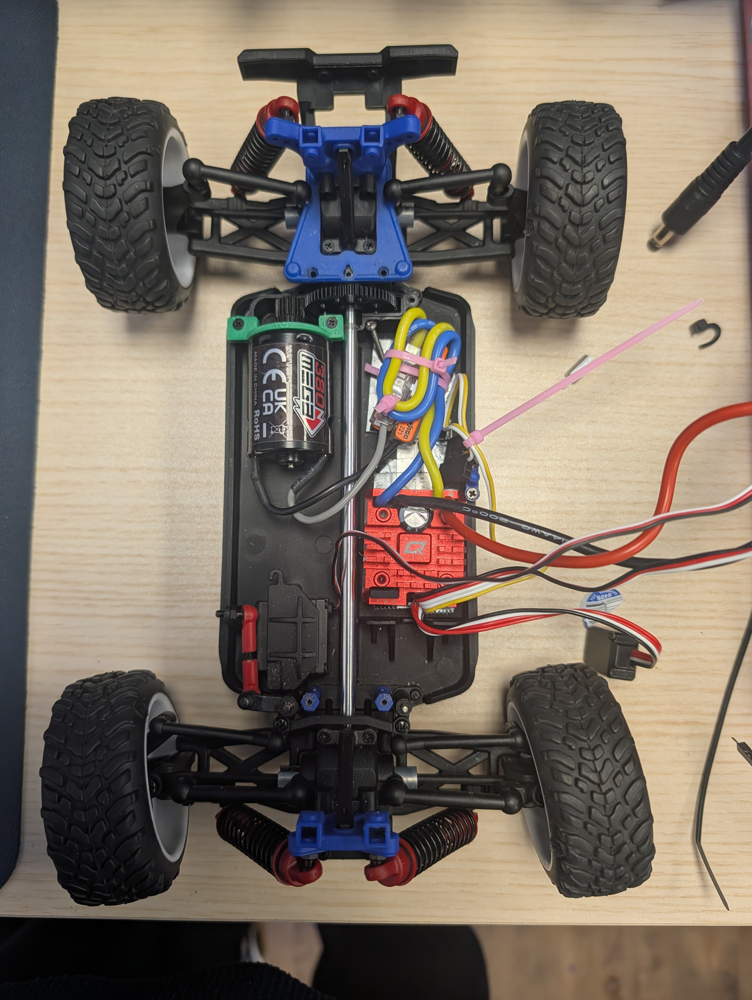

# Future Engineers WRO2026: BRB Robotics

## Team Intro

We are team BRB Robotics from Charlottesville, Virginia, USA.

Dorina, ....

Sagnick, ... a few words about yourself

### Team Pictures
TODO we need to take them today

### Robot Pictures
Here is our robot.

  
  
  
  
  
  
  

## Bill of Materials

### Mobility/Drive Train

The current version of the robot uses the following components:
- Modified *LaTrax Dessert Prerunner* base available from [Amazon](https://www.amazon.com/dp/B07TV8HMC5?lv=shuf&channelId=500&plpRedirect=mhFallback), [Traxxas](https://traxxas.com/latrax-desert-prerunner-76064-5), or RC cars retailers.
- Motor: *ARRMA MEGA 380 BRUSHED MOTOR* available at [Amazon](https://www.amazon.com/dp/B0CLDRTG4G?ref=fed_asin_title)
- Servo: *Traxxas Metal Gear 2265* available from [Traxxas](https://traxxas.com/2265-high-torque-metal-gear-sub-micro-servo?srsltid=AfmBOoofV5AQJdtCUieAbU9K7mZUhkndheuulxu12r3GfdbZ7cWQ8eoh)  and other retailers.
- Motor gear: *0.5M 60T Steel Spur Gear for Traxxas LaTrax 1/18 RC Cars 7640* available from [Amazon](https://www.amazon.com/dp/B0DK6524Z9?ref=fed_asin_title)  and other retailers.
- Electronic Speed Controller: *HOBBYWING QUICRUN WP 1080 G2 Brushed 2-3s* available from [Amazon](https://www.amazon.com/dp/B0DK6524Z9?ref=fed_asin_title)  and other retailers.

### Power

1. **Battery**: *Ovonic air lipo 3s 3000 mAh 11.1v* available from [Amazon](https://www.amazon.com/dp/B0DF2BL8H1?ref=fed_asin_title) and other retailers.
2. **Power Distribution Board**: *XT60 to 4 Channel XT60 Plug Power Distribution Board* available from [Amazon](https://www.amazon.com/dp/B0FQTJSRVB?ref=fed_asin_title) and other retailers.
3. **Voltage Regulator**: *5V, 3A Step-Up/Step-Down Voltage Regulator S13V30F5* available from [Pololu](https://www.pololu.com/product/4082) and other retailers.
4. Power Switch

### Sensors

1. **IMU + Odometry**: *SparkFun Optical Tracking Odometry Sensor - PAA5160E1 (Qwiic)* available from [Spark Fun](https://www.sparkfun.com/sparkfun-optical-tracking-odometry-sensor-paa5160e1-qwiic.html?utm_source=google&utm_medium=cpc&utm_campaign=Generic+%7C+PMax&utm_content=Brand&gad_source=1&gad_campaignid=17479024030&gbraid=0AAAAADsj4ESHUtbOsWJc8GcLReGb1kG2B&gclid=CjwKCAjwqonVBhA4EiwA9wYJ3ZYasXIYYnbl7VBg3RL0S3rhNfDKmTCtPxU8W_cJBcz2ZNOKSQu-kRoC_G0QAvD_BwE)
2. **Lidar**: *STL-27L 360° DTOF LIDAR Sensor (UART, 25m)* available from [DFROBOT](https://www.dfrobot.com/product-2726.html).
3. **Camera**: *Limelight 3A* available from [GoBilda](https://www.gobilda.com/limelight-3a-smart-camera/) and other retailers.

### Computing Components

1. **Main Computer**: *Jetson Orion Nano Developer Kit B01 8G* . The model we used was replaced by [VIDIA Jetson Orin Nano™ Super](https://www.nvidia.com/en-us/autonomous-machines/embedded-systems/jetson-orin/nano-super-developer-kit/).

2. **Low-level Controller**: *Teensy 4.1* available from [Amazon](https://www.amazon.com/dp/B08CTM3279?ref=fed_asin_title) and other retailers.

## Other Materials
- *Pololu Isolated USB-to-I²C Adapter with Isolated Power* available from [Pololu](https://www.pololu.com/product/5397) and other retailers.
- Medium Density Fiberboard/Black Acrylic/Wood for fabricating the two plates.
- PLA Fillament for 3D printing the motor connector, and mounts for various electronic components.
- Screws. We used screws we had in the robotics center including origininal screws from the Traxxas car, [M4 12 mm socket screws](https://www.gobilda.com/m4-socket-head-screws?srsltid=AfmBOooi6TK-TZ9bD9ic7EdKZm5Tyzp37X25FX4myRjO1b7F6xaQRzz2), and a variety of [M3, M2.5, and M2](https://www.mcmaster.com/products/screws/system-of-measurement~metric/thread-size~m3/thread-size~m2-5/?utm_term=threaded+rod&matchtype=b&campaignid=22278146823&adgroupid=181242746131&location=1027070&gad_source=1&gad_campaignid=22278146823&gbraid=0AAAAACLR9bzaXlCR2EvGV1Gc1mSH9ewEM&gclid=Cj0KCQjwzY7VBhDwARIsAFtPvBSGFOZhe7nNpMewGu6YA5U2lPPOkHGL-baxAmwzWf-pWD5ilcQYg30aAjKKEALw_wcB) screws.
- Standoffs. As with the screws, we used standoffs we had available in our lab. We used 4 [GoBilda 8mm REX™ M4 x 0.7mm Threads, 48mm Length](https://www.gobilda.com/1516-series-8mm-rex-standoff-m4-x-0-7mm-threads-48mm-length-4-pack/)  and 4 [Male-Female Threaded Hex Standoffs](https://www.mcmaster.com/products/threaded-spacers/standoffs-2~/male-female-threaded-hex-standoffs-2~~/?utm_term=threaded+rod&matchtype=b&campaignid=22278146823&adgroupid=181242746131&location=1027070&gad_source=1&gad_campaignid=22278146823&gbraid=0AAAAACLR9bzaXlCR2EvGV1Gc1mSH9ewEM&gclid=Cj0KCQjwzY7VBhDwARIsAFtPvBSGFOZhe7nNpMewGu6YA5U2lPPOkHGL-baxAmwzWf-pWD5ilcQYg30aAjKKEALw_wcB).
- [Dupont wires](https://www.amazon.com/dp/B01EV70C78?ref=fed_asin_title)
- Electrical Tape
- small zip ties
- [XT60 female connector to a DC barrel jack plug](https://www.amazon.com/5-5mm%C3%972-1mm-Extension-Connector-Battery-Portable/dp/B0FK2HSQSM/ref=sr_1_1_sspa?crid=2S63D4GSTYZPS&dib=eyJ2IjoiMSJ9.S0IAqjWm2GUoV504bTe38WexpLGCirgZyiO1a2Zc-K2w5RaPFeCCPkNuDEksw703-HRWA-e7AycCqHG34ZxdY_5Ag46assF2Xy8KWsajLncyiQgYshgS6i8jpmKrjhAYQABz9kmwK9CPXI0Zl08dH4IFkvbIg7yF42qMgGqYGMZd7dGJarZeWgsTrLNr22hMk2YhhHUzYcJlcnEOT5wlvInFkgF6ZLo0C55vcu-oxN107sxvv9XmsNvS4sgwYQ4MRI1Ki3n4S15ZF0SyJz2OJeP96nfkOedplso9aNUnshg.4mJc9HrcG77gZubBaxoUjVQNLCzcouInxg5WLhqWJVQ&dib_tag=se&keywords=XT60%2Bmale%2Bconnector%2Bto%2Bmale%2BDC%2Bbarrel%2Bjack%2Bplug&nsdOptOutParam=true&qid=1789135071&s=industrial&sprefix=xt60%2Bmale%2Bconnector%2Bto%2Bmale%2Bdc%2Bbarrel%2Bjack%2Bplug%2Caps%2C113&sr=1-1-spons&sp_csd=d2lkZ2V0TmFtZT1zcF9hdGY&th=1)
- [14×14×7mm Aluminum Heatsink with Conductive Adhesive Tape](https://www.amazon.com/dp/B0CFKHNTDV?ref=fed_asin_title&th=1)
- fuse

## Assembly and Manufacturing

We structured our car in three layers.

### Base Layer

#### Prepare the Base
Strip all the components off the the *LaTrax Dessert Prerunner* until you are left with only the components shown in the picture below. Also, remove the motor gear assembly. Save all the screws for later use.

  

#### Install the ESC

The location of the ESC is shown in the image below.
 

  

We secured the ESC to the base layer with double-sided tape.

#### Attaching the motor

For attaching a stronger motor to the base, we removed the top gearbox housing and 3d printed a new one to fit the new, larger and more powerful motor.

1. Replace the platic gears in the original car with the metal ones.
2. 3D print the motor mount
3. Secure the motor in the new mount making sure the gears connect properly.

#### Attaching the servo

 For replacing the servo we simply got one with the same dimensions and replaced it with no need for any new mounts.
 
#### Attaching the SparkFun Odometry

We also conected the OTOS sensor to the bottom of the car for odometry readings. We used double-sided tape and electrical tape.
 
#### Connection with the first layer

 To be able to mount new compontents we replaced the blue plate with a new wooden laser cut mount. We connected the back directly to the traxxas base using the original screws.
 In the front, we used a 3D printed block to ensure the first layer is perfectly horizontal. We used the original screws to connect the front of the first layer.

### First Layer

This layer consists of a laser-cut, wooden base plate that holds mounts for electronic components. Mounts for the battery, the on/off switch,and the Power Distribution Board are 3D printed using PLA and screwed into the base plate. The Lidar is simply mounted by screwing it in directly to the wooden plate. It also supports four metal GoBilda standoffs that connect the top plate. We choose wood for the material because it is easy and fast to laser cut, and it is less expensive so we have lots of spare material in case the top and middle plates break.

  
  

### Second Layer

The top plate is much like the middle plate; except for the shape and the electronics it holds. It is also made of wood and is laser-cut and attaches four different components:
- The Jetson Nano is directly screwed into the board suported by standoffs.
- We connected the teensy perpendicular to the wooden plate.
- The 3D printed camera mount is screwed into other holes on the Nano board.
- The I2C to USBC adapter is connected using mounts.
 

  
  
 

## Power Wiring Diagram

As seen from the diagram below we have three separate braches powered directly from the battery so that a power hungry component does not starve others.

1. Power Distribution board (PBD) ==> ESC ==> Motor
2. PBD ==> Step-Down Voltage Regulator ==> servo (power+ground) and Teensy (ground)
We planned to power the teensy from the Voltage Regulator. For software development it is easier if we power the jetson from the wall and power the Teensy, lidar, and camera from the jetson.
A robust competition wiring is to connect the Teensy to the Jetson using a data only cable and power from the Voltage Regulator.
3. PBD ==> Jetson

==> Camera through the USBC to USBA cable

==> I2C adapter with a USBC to USBA cable ==> Lidar with an I2C cable

==> Teensy with MicroUSB to USBC or USBA

==> Odometry (3.3V pin + ground)

## Data Wiring

The connecting cables between Jetson Orin and lidar, camera, and Teensy are data cables.

# Contents

- Because we use ROS 2, having a `src` folder would prevent it from being used properly. For this reason, we created a folder for documentation containing all of the required content.
- `t-photos` contains two photos of the team: an official team photo and a funny photo with all team members.
- `v-photos` contains six photos of the vehicle from every side, as well as from the top and bottom.
- `video` contains the `video.md` file with a link to a video that includes a driving demonstration.
- `schemes` contains one or more schematic diagrams in JPEG, PNG, or PDF format of the electromechanical components. These diagrams illustrate all of the electronic components and motors used in the vehicle and how they are connected to each other.
- `models` contains the files for models used by 3D printers, laser-cutting machines, and CNC machines to produce the vehicle's components. If there is nothing to add to this folder, the directory can be removed.
- `other` contains additional files that can be used to understand how to prepare the vehicle for the competition. This may include documentation on how to connect to an SBC/SBM and upload files, datasets, hardware specifications, communication protocol descriptions, and other relevant information.
